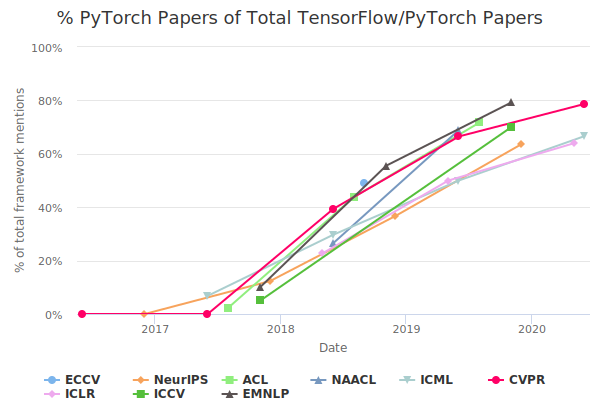

以下に `Colab` の特徴を列挙します

1. クラウド上の計算機資源
2. 無料
4. ブラウザ上で実行可能な Jupyter ノートブック環境
4. TPU, GPU の実行環境も提供

<!--
!wget outline-map-of-world-asia-and-australia-centered-vector-22634211.jpg

-->

 

`Colab` はクラウド上の計算機資源。従って手元の PC に保存されているデータを直接利用できない。
同様に計算結果を保存するためには別の保存場所，クラウドドライブや PC などに転送する必要が生ずる。

クラウド上で無料で利用可能な実行環境です。そのため，以下のような長所があります。

1. **面倒なインストール作業が不要**
2. したがって **複雑なライブラリの依存関係に悩む必要がない**
2. **ブラウザ上で実行可能** そのために直感的な操作感が偉える

一方短所としては以下の点が挙げられます。

1. 自身のデータを用いる場合にはアップロード/ダウンロードの作業が発生する
2. 逆に言えば何もしなければ，どこにも保存されない
3. Google の都合で勝手にライブラリがアップデートされる。そのため以前動作したプログラムがバージョンの不一致を起こす場合がある
2. 一定時間何もしないと切断される
3. Google Chrome での実行が推奨される。Google 社製だけに排他的な側面があります

本特別企画では長所が短所を凌駕すると判断し `Colab` を用いることにいたします。

# Python について

本チュートリアル実習では，言語パイソン (
<a href="https://www.python.org/" target="_blank">python</a>) のブラウザ上での実行環境 
ジュピターノートブック (<a href="https://jupyter.org" target="_blank">jupyter notebook</a>) を用います。
Jupyter notebook はそれぞれの PC 上で実行する環境です。
この実行環境をクラウド上で実行する環境を `Colab` と呼びます。

Python はコンピュータ言語の一つです。
本実習ではコンピュータ言語 python の書式や使い方については深入りしません。
<a href="https://insights.stackoverflow.com/trends?tags=python%2Cjavascript%2Cjava%2Cc%23%2Cphp%2Cc%2B%2B" target="_blank">Stackoverflow における言語トレンド</a>
 も見てください[^stackoverflow]。 

[^stackoverflow]: <https://stackoverflow.com> とはプログラムに関する Q and A を投稿，知識共有のためのサイトです。

Python を採用する理由は業界標準 (de facto standard) であることです。
ディープラーニングを実装するアルゴリズムは python で書かれるようになりました。
Python はコンピュータ言語の一つですから，他のコンピュータ言語と遜色は有りません。
他のコンピュータ言語との大きな相違は，共有可能なプログラム ---ライブラリやフレームワークと言ったりする--- が揃っていることです。
新しいアルゴリズムを発表する場合，既存のライブラリを用いて構築することで誤りも減ります。
また使ってもらえる可能性も高まります

逆に言えば，python を覚えただけではディープラーニング技術に精通したことになりません。
python で動作する業界標準とみなされているフレームワーク，ライブラリ，プログラムを知っている必要があります。

ディープラーニングに特化した python で動作するディープラーニング用のライブラリ 3 つについて言及します。

1. <a target="_blank" href="https://keras.io/">Keras<a>
2. <a target="_blank" href="https://pytorch.org/">PyTorch</a>
3. <a target="_blank" href="https://www.tensorflow.org">TensorFlow</a>

上記 3 つ以外にも多くのライブラリ，フレームワークがあります。
次図をご覧ください:

この図は 2020 年 7 月 15 日時点での，プログラムのソースコード共有サイト <a target="_blank" href="https://github.com/">GitHub</a> における，ディープラーニングの実装を扱うフレームワークの代表的なものを取り上げ，それらの星の数を横軸の時間の関数としてプロットしたものです。
図から TensorFlow が他を圧倒していることが分かります。
TensorFlow 以外の星の数が，TensorFlow の数によって分かりにくいので，TensorFlow を除いて
同じグラフを描いたものが下図です。

上図によれば，keras の数が多いことが分かります。
Keras に加えて，keras を 追いかけるように上昇しているの曲線が見て取れます。
このカーブが PyTorch です。

上 2 図から TensorFlow, Keras, PyTorch の順に "星の数" が多いすなわち人気が高いことが分かります。

Keras は TensorFlow を扱いやすいようにするためのライブラリです。
従って Keras では裏 "バックエンド" で TensorFlow が動作している場合が多いです。
多くのユーザの要望を取り入れて大きく高機能となった TensorFlow を覚えるよりも，とりかかり易い手軽な keras を使った方が初学者には敷居が低くて良いと思われます。
TensorFlow 側でも keras の学習容易性という特徴を重視して TensorFlow に keras を取り込んでいます。
2020 年に公開された TensorFlow 2.0 では Keras が取り込まれました。
Keras 単体としての更新は 凍結されています。

一方，PyTorch は TensorFlow と Keras の 2 つのフレームワークとは独立のフレームワークです。
コーネル大学の論文のリポジトリサイト "<a href="https://arxiv.org" target="_blank">arXiv</a>"
などで発表される論文では PyTorch が支配的です[^my_opinion01]。まとめると次のことが言えるでしょう。

1. 人気は TensorFlow が圧倒的だが
2. 手軽に試すには簡単な keras が好まれ
3. 研究ベースでは PyTorch が選好される

[^my_opinion01]: 筆者の主観です。ですがこの言質に対する反論は聞いたことが有りません。

また，我が国における TEnsroFlow, Keras, PyTorch の人気については，<https://trends.google.com/trends/explore?geo=JP&q=pytorch,keras,tensorflow> をご覧ください。
<https://trends.google.com/trends/explore?date=today%205-y&geo=JP&q=pytorch,keras,tensorflow>

下図に主たる国際会議で採択された論文中の PyTorch と TensorFlow の割合を示しました。
先述の通り，PyTorch の割合が増加していることが見て取れます。

	 
	source: <http://horace.io/pytorch-vs-tensorflow/>

# Colaboratory 事始め

- Google Colaboratory は jupyeter notebook をご存知であれば，ほぼ使い方は同じです。
    - notebook は セル と呼ばれる単位から成り立っています。
    - セルは コード，テキスト，画像で構成されます。
    - クラウドベースの実行系ですので，インストールの手間は不要です。
    - Google Doc に保存可能で Google Drvie 経由シェアできます
    - テキストはマークダウン形式で書きます
- ブラウザを立ち上げて  も参照してください

- 

<!--
https://colab.research.google.com/notebooks/basic_features_overview.ipynb](https://colab.research.google.com/notebooks/basic_features_overview.ipynb">
-->

- 
- <a target="_blank" href="https://youtu.be/Bgwujw-yom8">ユーチューバー Siraj さん, "クラウドを使ってニューラルネットワークを訓練する方法 "How to Train Your Models in the Cloud"</a>

<!--
- 
-->

<!--
- [少し時間がかかりますが Keras によるニューラル画像変換を実行](https://colab.research.google.com/github/tensorflow/models/blob/master/research/nst_blogpost/4_Neural_Style_Transfer_with_Eager_Execution.ipynb)  してみることをお勧めします
    - [https://research.google.com/seedbank/seeds](https://research.google.com/seedbank/seeds)
-->
